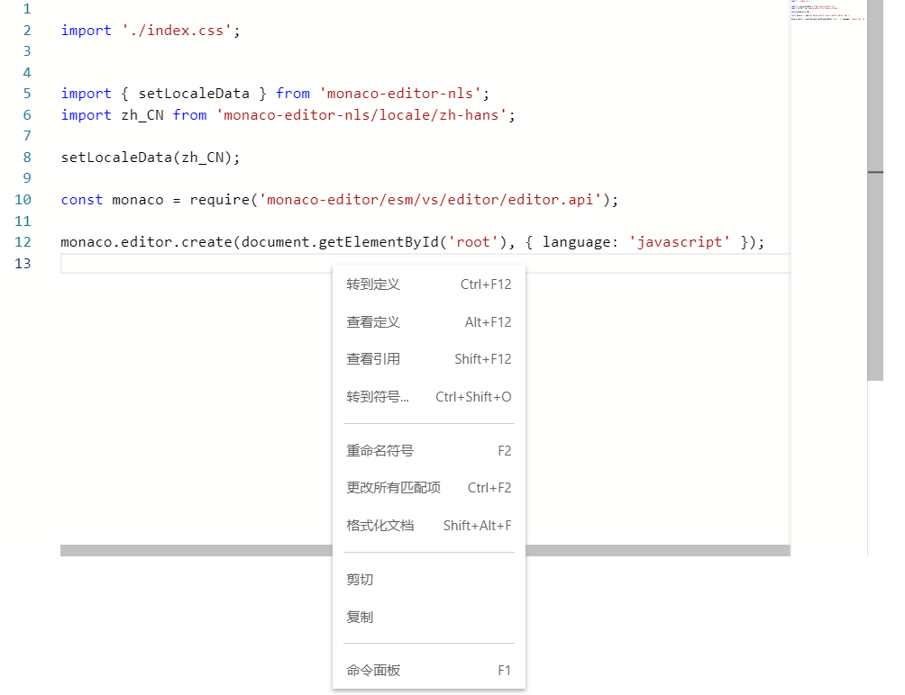

# monaco-editor-esm-webpack-plugin

[Change log](CHANGELOG.md)

> It dependency on [monaco-editor-webpack-plugin](https://github.com/microsoft/monaco-editor-webpack-plugin).  
> If you want copy a monaco editor with localization, you can see [primefaces-monaco](https://github.com/blutorange/primefaces-monaco/blob/master/ESM-I18N.md)

The webpack's plugin for monaco editor to compile the worker and handle with localization.



## Installing

`npm install monaco-editor-esm-webpack-plugin --save-dev`

`npm install monaco-editor monaco-editor-webpack-plugin monaco-editor-nls`

## Using

- `webpack.config.js`

    ```
    const MonacoWebpackPlugin = require('monaco-editor-esm-webpack-plugin');

    module.exports = {
        entry: './index.js',
        output: {
            path: path.resolve(__dirname, 'dist'),
            filename: 'app.js'
        },
        module: {
            rules: [
                {
                    test: /\.js/,
                    enforce: 'pre',
                    include: /node_modules[\\\/]monaco-editor[\\\/]esm/,
                    use: MonacoWebpackPlugin.loader
                },
                {
                    test: /\.css$/,
                    use: ['style-loader', 'css-loader']
                }
            ]
        },
        plugins: [
            new MonacoWebpackPlugin()
        ]
    };
    ```

## Localization

- Set the locale data in your code

    ```
    // index.js
    import { setLocaleData } from 'monaco-editor-nls';
    import zh_CN from 'monaco-editor-nls/locale/zh-hans';

    setLocaleData(zh_CN);

    // You must import/require after `setLocaleData`
    // Do not use `import * as monaco from 'XXX'`, but can use `import('xxx').then(XXX)`
    const monaco = require('monaco-editor/esm/vs/editor/editor.api');

    monaco.editor.create(document.getElementById('root'), { language: 'javascript' });
    ```

## Options

There only two options for this plugin. But you can set the [monaco-editor-webpack-plugin's options](https://github.com/microsoft/monaco-editor-webpack-plugin#options) in this options. such as: `new MonacoWebpackPlugin({ languages: ['typescript'] })`

- isMonacoEditorWebapckPlugin - whether [monaco-editor-webpack-plugin](https://github.com/microsoft/monaco-editor-webpack-plugin) is used. Default: `true`

- isReplaceNls - whether replace the nls file. Default: `true`


## Q & A

- Why the project can't start after add the plugin with `monaco-editor` and `monaco-editor-webpack-plugin` ?

    The version of `monaco-editor` should match with `monaco-editor-webpack-plugin`, you can see: https://github.com/microsoft/monaco-editor-webpack-plugin/#version-matrix
